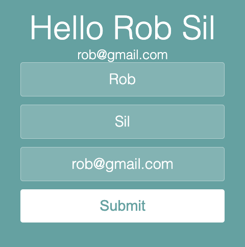

## Description
Managing complex state with `useState` in React involves creating multiple state variables for each aspect of the application’s data, which might require updates across various parts of a component. For example, in a form with multiple fields, each field's state can be managed with separate `useState` hooks. Alternatively, a single `useState` hook can hold an object or array to manage related data.

## Challenge
Follow the instruction in the index.js file

### Expected Result


## Setup

1. Clone the repository and install the dependencies
```bash
npm install
```
2. Start the frontend application locally
```bash
npm start
```